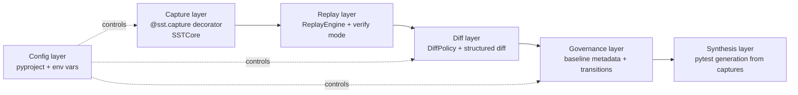
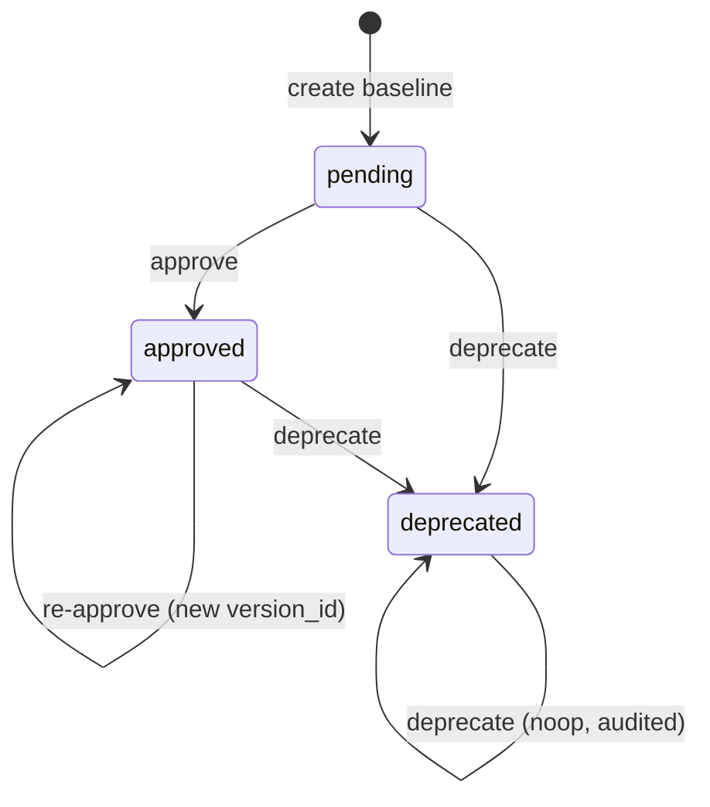

# SST Architecture

SST is organized as a deterministic pipeline that turns live execution into policy-governed regression checks.

## High-level architecture



### Layer responsibilities

- **Capture**: serializes function inputs/outputs via `_CaptureNormalizer.serialize`, masks PII, assigns `semantic_id`, and writes JSON artifacts in the shadow directory. Custom classes can implement `__sst_serialize__(self) -> Any` to control serialization; SST calls it before falling back to `__dict__` introspection or a structured `{"__class__", "__repr__"}` fallback.
- **Replay**: aligns baseline and current captures by deterministic scenario key (`module.function:semantic_id`) and compares outputs.
- **Diff**: applies configured suppression/normalization policy, then computes path-aware structured changes.
- **Governance**: stores baseline status/version metadata, validates allowed transition actions, and preserves audit history.
- **Synthesis**: turns captured scenarios into pytest tests for wider regression and refactoring confidence.

## `semantic_id` in detail

`semantic_id` is the core identity primitive for a scenario.

1. SST takes the captured call input (`{"args": ..., "kwargs": ...}`) after serialization and PII masking.
2. Input is canonicalized (dict keys sorted recursively; primitive values encoded with explicit type prefixes such as `int:1`, `str:1`, `bool:True`).
3. The canonical JSON string is SHA-256 hashed.
4. The first 32 hex chars are used as the `semantic_id`.

Canonicalization is recursion-safe and bounded, so pathological nested payloads cannot cause unbounded traversal during identity construction.

Implications:

- **Stable matching**: replay and verify do not depend on wall clock or file names.
- **Input-centric identity**: changing only output behavior keeps the same `semantic_id`, which is exactly what regression checks need.
- **Type-aware collision resistance**: canonicalization includes primitive type names (`int:1` and `str:1` are distinct) to prevent cross-type collisions in semantic IDs.
- **PII-safe hashing**: IDs derive from masked payloads, so raw sensitive values are not embedded in baseline identity.

## Serialization protocol

SST serializes captured values through `_CaptureNormalizer.serialize` with the following priority chain:

1. **Primitives** (`str`, `int`, `float`, `bool`, `None`) — passed through as-is.
2. **`__sst_serialize__`** — if the object implements this method, SST calls it and recurses on the result. Opt-in, highest priority for custom types.
3. **`__dict__`** — standard Python objects are serialized as `{"__class__": "Name", ...fields}`.
4. **Structured fallback** — objects with neither `__sst_serialize__` nor `__dict__` are serialized as `{"__class__": "Name", "__repr__": "..."}`. The `__repr__` value may be non-deterministic for some types; implement `__sst_serialize__` when stable `semantic_id` is required.

All paths are recursion-safe and bounded by `MAX_DEPTH = 100`.

## Diff policy model

SST applies policy in two phases before deep diff:

1. **Field suppression (`apply_diff_policy`)**
   - Removes keys listed in `ignored_fields` recursively.
   - Defaults include volatile fields like `timestamp`, `transaction_id`, `uuid`, etc.
2. **Normalization (`normalize_for_compare`)**
   - Sorts dict keys for deterministic ordering.
   - Recursively traverses lists (including nested list/dict combinations) so every JSON-serializable branch is normalized consistently.
   - Rounds floats based on configured `float_tolerance`.
   - Optionally masks ISO timestamps as `<timestamp>` when `mask_timestamps=true`.

After normalization, `build_structured_diff` reports change entries with:

- `path` (JSON-like location),
- `change_type` (`added`, `removed`, `value_changed`, `type_changed`, `length_changed`),
- severity (`high`/`medium`/`low`),
- baseline/current snapshots.

This keeps comparisons auditable and predictable, while still reducing noise from known dynamic fields.

### Null safety in replay/diff pipeline

The replay pipeline is explicitly null-safe end to end:

- `apply_diff_policy` accepts `None` snapshots and returns `None` without error.
- `build_structured_diff` handles `None` as a primitive value and safely reports type/value changes when compared against non-null data.

This prevents crashes when baseline or capture snapshots are empty or partially missing while preserving deterministic diff behavior.

## Governance transitions

Baseline records include metadata:

- `format_version`
- `version_id`
- `created_at`
- `approved_at`
- `scenario_status` (`pending` | `approved` | `deprecated`)

Transition decisions are evaluated by policy (`GovernancePolicy.transitions`) and produce a deterministic `GovernanceDecision` with `policy_id`, `decision_id`, and reason code.



Notes:

- Lifecycle is `pending -> approved -> deprecated` for standard governance.
- `approve` updates scenario payload and rotates `version_id`.
- `deprecate` excludes scenario from replay checks while preserving history.
- Unsupported transitions are rejected with `INVALID_TRANSITION` in fail-fast mode by default.

### Governance Policy Enforcement

- Governance transitions are validated in fail-fast mode by default.
- Invalid lifecycle transitions raise a governance policy error immediately.
- SST supports optional custom governance transition validators for advanced integrations.
- Strict governance mode is enabled by default to preserve deterministic scenario lifecycle behavior.

## Semantic Silence

SST is designed for semantic silence: high-signal regression enforcement with low developer noise. The policy layer suppresses non-functional drift (timestamps, request IDs, trace IDs, and similar operational churn) so teams focus only on business-meaningful behavior changes. This materially reduces alert fatigue in CI and keeps the regression firewall strict where it matters—functional correctness.

## Extensibility points (custom policies)

SST has policy-oriented boundaries you can extend safely:

### 1) Custom diff policies

Use `DiffPolicy` directly when invoking diff utilities programmatically:

```python
from sst.diff import DiffPolicy, apply_diff_policy, normalize_for_compare

strict_policy = DiffPolicy(
    policy_id="strict-v2",
    semantics_version=1,
    ignored_fields={"request_id"},
)

filtered = apply_diff_policy(payload, policy=strict_policy)
normalized = normalize_for_compare(filtered)
```

You can also configure default policy behavior via `[tool.sst.diff_policy]` or `SST_DIFF_*` env vars for CLI/runtime usage.

### 2) Custom governance policies

Define alternative transition maps and pass them to the decision engine:

```python
from sst.governance import GovernancePolicy, evaluate_governance_decision

change_control_policy = GovernancePolicy(
    policy_id="change-control-v1",
    transitions={
        ("approve", "pending"): (True, "APPROVE_ALLOWED", "Initial approval."),
        ("approve", "approved"): (False, "REAPPROVE_BLOCKED", "Re-approval requires CAB signoff."),
        ("deprecate", "approved"): (True, "DEPRECATE_ALLOWED", "Controlled retirement."),
    },
)

decision = evaluate_governance_decision("approve", "approved", policy=change_control_policy)
```

### 3) Baseline format evolution

The governance loader has explicit migration hooks (`_migrate_record_for_version`) and supported-version checks. Use this hook when introducing future schema versions while keeping deterministic upgrades.

### 4) Capture-level sampling and placement

Capture can be tuned per function with `@sst.capture(sampling_rate=...)` and globally with config/env overrides. This is the primary extension point for balancing observability vs overhead in production paths.

`sst verify` always overrides `SST_SAMPLING_RATE=1.0` in the subprocess environment it spawns. This guarantees the regression gate captures every decorated call regardless of the project's configured sampling rate. Production sampling is intentionally isolated from verification completeness.

## Versioning and Compatibility Guarantees

To protect interpreter-contract invariants over time, baseline records persist runtime contract metadata:

- **Engine contract**: `scenario.engine_version` stores capture-time SST version.
- **Diff contract**: `metadata.diff_policy_snapshot` stores effective diff policy, semantics version, and deterministic hash.
- **Governance contract**: `metadata.governance_policy_snapshot` stores transition policy and deterministic hash.

Replay/verify behavior:

- Engine version mismatch is advisory and explicitly reported as reinterpretation risk.
- Policy snapshot mismatch is classified as `POLICY_DRIFT` regression.
- Diff policy `semantics_version` advancement over captured baseline is treated as compatibility drift.

Compatibility policy:

- Legacy baselines continue to load without migration.
- Missing new metadata fields emit warnings (advisory mode), enabling gradual adoption.
- Any semantic change in normalization requires `DiffPolicy.semantics_version` bump and baseline re-approval.
