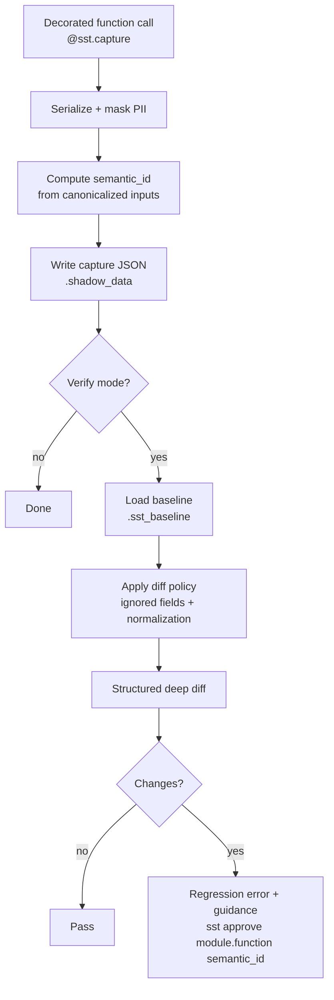

# SST: Production Behavior Regression Firewall

[](https://opensource.org/licenses/MIT)

SST (Semantic Shadow Testing) is not just a test generator—it is a **mission-critical regression firewall** for Python applications. It captures real production behavior and ensures that no refactoring or code change ever breaks your business logic.

## Why SST?

Companies don't pay for "more tests"; they pay for **stability**. SST turns your production data into a **Regression Gate** that blocks unsafe merges.

*   **Guarantee Stability**: Ensure refactoring never changes the actual output of your functions.
*   **Mission-Critical Safety**: Block PRs automatically if behavior deviates from the recorded baseline.
*   **Zero-Effort Coverage**: Generate high-quality Pytest suites from real-world execution scenarios.

## Core Workflow: The Regression Gate

### 1. Record the Baseline
Capture the "Source of Truth" from your production or staging environment.
```bash
sst record production_app.py
```
This saves the inputs, outputs, and semantic signatures into `.sst_baseline/`.

### 2. Verify in CI (The Firewall)
Add SST to your CI/CD pipeline. If a code change alters the behavior of a function, the build fails.
```bash
sst verify production_app.py
```
If a regression is detected, SST provides a **semantic diff** showing exactly what changed.

### 3. Intentional Change Workflow
If a change in behavior is intentional (e.g., a new feature), approve it to update the baseline:
```bash
sst approve module.function semantic_id
```

### Baseline Schema Validation

SST performs strict validation of baseline scenario records during baseline load and verify flows. Validation enforces both required field presence and expected runtime field types.

Required baseline schema:

```yaml
scenario:
  module: str
  function: str
  semantic_id: str
  input: dict
  output: any
```

Notes:

- Invalid baseline records raise a validation error during `sst verify` or baseline loading.
- Strict schema validation preserves deterministic semantic replay and behavioral integrity.

Example validation error:

```text
SST error [VALIDATION:BASELINE_VALIDATION_ERROR]: Invalid baseline scenario field 'input': expected dict, got list
```

### Governance Enforcement

SST governance transitions are enforced with a fail-fast model. When strict governance is enabled (default behavior), invalid transition requests (for example, an unknown action/state transition) are rejected immediately instead of being silently accepted.

This prevents baseline lifecycle drift and keeps approval/deprecation history auditable and deterministic in CI.

### CLI Reference

Use these commands to run SST as a production-grade regression firewall:

```bash
# Capture production/staging behavior into shadow artifacts
sst record <file>

# Run regression checks against the approved baseline
sst verify <file>

# Promote an intentional behavior change into the baseline
sst approve <scenario_id>

# List all scenarios and lifecycle status
sst baseline list

# Mark a scenario as obsolete while preserving audit history
sst baseline deprecate <scenario_id>

# Synthesize pytest files for all captured scenarios
sst generate --all
```

`<scenario_id>` is the deterministic scenario key (`module.function:semantic_id`).

#### Exit Codes

```text
0 → verify succeeded (no mismatches)
1 → verify completed with baseline/capture mismatch
2 → execution or configuration error (including validation and internal failures)
```

Deterministic exit codes make CI/CD gating reliable and automation-friendly.

#### `sst verify --json` output

The `--json` flag emits a machine-readable report with this structure:

```json
{
  "summary": {
    "timestamp": "2026-01-01T00:00:00+00:00",
    "sst_version": "0.2.0",
    "baseline_count": 12,
    "capture_count": 12,
    "mismatch_count": 1
  },
  "scenarios": [
    {
      "scenario_id": "module.function:semantic_id",
      "status": "pass|fail",
      "diff_summary": "",
      "diff": [],
      "baseline_version": "uuid-or-null"
    }
  ],
  "exit_code": 0
}
```

- `summary` aggregates run-level metadata and mismatch count.
- `scenarios` contains one row per baseline scenario, with normalized `pass|fail` status and diff details.
- `exit_code` mirrors verify result semantics for automation (`0` success, `1` mismatch).

---

## Test Confidence

We test the full CLI lifecycle end-to-end to ensure record, verify, approve, governance, and cleanup workflows remain stable over time.

## Features

*   **Deterministic Replay**: Replay production scenarios in isolated environments.
*   **Type-Safe Semantic IDs**: Fingerprinting is type-aware (`int:1` and `str:1` hash differently), so baseline scenarios keep collision-resistant identities across mixed Python data types.
*   **Semantic Diffing**: See exactly how your logic's output changed, not just that it failed.
*   **AI-Powered Test Synthesis**: Generate robust Pytest files with mocks and assertions using Claude 3.5 or GPT-4.
*   **Deep PII Masking**: Built-in PII protection recursively scans and masks sensitive data (emails, cards, phones, SSNs, tokens, etc.) even when nested in lists and complex payloads.

## Installation

```bash
pip install sst-python
```

## Centralized Configuration

SST can load configuration from `[tool.sst]` in `pyproject.toml` (searched from the current directory upward).
Environment variables still override file values, so you can tune behavior in CI without editing project files.

```toml
[tool.sst]
baseline_dir = ".sst_baseline"
shadow_dir = ".shadow_data"
sampling_rate = 1.0
pii_keys = ["session_token", "internal_id"]
governance_policy = "default"

[tool.sst.diff_policy]
ignored_fields = ["timestamp", "request_id"]
float_tolerance = 0.000001
mask_timestamps = true

# Ignore deeply nested non-functional data using JSONPath
ignored_paths = ["$.meta.request_id", "$.audit.trace_id"]

# Stabilize comparisons when list order is non-deterministic
sort_lists = true
```

Useful environment overrides include `SST_BASELINE_DIR`, `SST_SHADOW_DIR`, `SST_SAMPLING_RATE`, and `SST_GOVERNANCE_POLICY`.

Policy notes:

- Prefer `ignored_paths` when volatile fields are nested and you need precise suppression without dropping whole objects.
- Use `sort_lists = true` when APIs return semantically identical arrays in varying order.
- PII masking is recursive by default and traverses nested dict/list payloads automatically, so deep sensitive values are still protected.

## First Run: Hello World in 3 Steps

### 1) Install and decorate

```bash
pip install sst-python
```

```python
from sst import capture

@capture
def price_quote(total: int, discount: int = 0) -> dict:
    final = max(total - discount, 0)
    return {"total": total, "discount": discount, "final": final}
```

### 2) Record baseline

```bash
sst record app.py
```

### 3) Verify change

```bash
sst verify app.py
```

If behavior changes, SST fails verification with a semantic diff so you can approve only intentional deltas.

## Production capture

Use sampling to keep runtime overhead predictable when capture is enabled in production.

- Global sampling defaults to `1.0` (capture every call) and can be set in `[tool.sst]` with `sampling_rate = 0.05`.
- `SST_SAMPLING_RATE` overrides the config file at runtime.
- You can override sampling per function: `@sst.capture(sampling_rate=0.05)`.
- Set `SST_CAPTURE_ENABLED=false` to disable capture globally without changing code.

Lower sampling rates reduce file I/O and serialization overhead while still collecting representative production behavior.


## How it works under the hood

SST runs as a layered pipeline from runtime capture to policy-enforced approval:



Key internal mechanics:

- **Scenario identity** is `module.function:semantic_id`, where `semantic_id` is a deterministic hash of masked/canonicalized inputs.
- **Diffing is policy first**: noisy fields are suppressed and floats/timestamps normalized before value comparison.
- **Governance metadata** tracks status (`pending`, `approved`, `deprecated`), version IDs, and approval history for auditable baseline lifecycle.
- **Replay mode** matches captures to baselines by scenario identity and produces structured + human-readable diffs for CI.

## Production best practices

### 1) Where to place `@sst.capture`

- Decorate **business-logic boundaries** (pricing, eligibility, scoring, reconciliation, critical transforms).
- Avoid wrapping ultra-low-level utility functions unless they represent stable contract surfaces.
- Prefer one decorator per meaningful unit of behavior over broad blanket instrumentation.

### 2) Overhead considerations

Capture overhead is mainly:

- serialization/deserialization,
- masking + hashing,
- JSON file I/O.

To keep p95 latency predictable:

- start with selective instrumentation,
- keep payloads compact where possible,
- tune `sampling_rate` for high-volume endpoints,
- disable quickly with `SST_CAPTURE_ENABLED=false` during incidents.

SST hardens production use with built-in recursion protection (`MAX_DEPTH`) and high-performance recursive PII masking, making large nested payloads safe to capture and compare.

### 3) Use sampling intentionally

- Start with low rates (for example `0.01`–`0.05`) on hot paths.
- Increase temporarily during launches/migrations to collect richer behavior.
- Use per-function overrides (`@sst.capture(sampling_rate=...)`) when one module needs finer coverage than the global default.

### 4) Baseline migration strategy

- Treat baseline updates as controlled change events.
- When behavior change is intentional, review semantic diff output and then approve targeted scenarios.
- Keep baseline format/version metadata in source control if you snapshot baselines for release governance.
- Deprecate obsolete scenarios instead of deleting blindly, so replay scope remains explicit.

### 5) Large-project operating tips

- Partition capture directories by service/component in monorepos to avoid oversized artifact buckets.
- Run verify in parallel shards by module ownership when baseline sets become large.
- Standardize `ignored_fields` centrally to reduce team-by-team drift.
- Add governance list/show checks in CI dashboards so owners can monitor pending/deprecated scenario trends.

## Custom policy examples

### Custom diff policy (programmatic)

```python
from sst.diff import DiffPolicy, apply_diff_policy, normalize_for_compare

fintech_policy = DiffPolicy(
    policy_id="fintech-v1",
    semantics_version=1,
    ignored_fields={"request_id", "trace_id", "generated_at"},
)

baseline = normalize_for_compare(apply_diff_policy(baseline_payload, policy=fintech_policy))
current = normalize_for_compare(apply_diff_policy(current_payload, policy=fintech_policy))
```

### Custom governance transition policy (programmatic)

```python
from sst.governance import GovernancePolicy, evaluate_governance_decision

policy = GovernancePolicy(
    policy_id="strict-approval-v1",
    transitions={
        ("approve", "pending"): (True, "APPROVE_ALLOWED", "Initial approval allowed."),
        ("approve", "approved"): (False, "REAPPROVE_REQUIRES_REVIEW", "Second approval requires review board."),
        ("deprecate", "approved"): (True, "DEPRECATE_ALLOWED", "Scenario retirement allowed."),
    },
)

decision = evaluate_governance_decision("approve", "approved", policy=policy)
print(decision.allowed, decision.reason_code)
```

## Advanced Usage

### AI Test Generation
Generate a full Pytest suite from your captured data:
```bash
sst generate --all --provider anthropic --edit
```

### Getting Started with AI Synthesis

AI synthesis requires an API key for the provider you choose:

```bash
export OPENAI_API_KEY="your-openai-key"
export ANTHROPIC_API_KEY="your-anthropic-key"
```

Provider selection:

- `--provider anthropic`: uses Anthropic models (for teams standardized on Claude).
- `--provider openai`: uses OpenAI models (for teams standardized on GPT).

Example:

```bash
sst generate --all --provider openai
```

Generated tests include deterministic setup, mocking, and explicit assertions. A minimal example:

```python
from unittest.mock import patch

from app import compute_quote


def test_compute_quote_applies_discount():
    with patch("app.fetch_discount", return_value=10):
        result = compute_quote(user_id="u-1", subtotal=100)

    assert result["subtotal"] == 100
    assert result["discount"] == 10
    assert result["total"] == 90
```

## License

This project is licensed under the MIT License - see the [LICENSE](LICENSE) file for details.

## GitHub Repository

Contribute to the future of behavioral testing on [GitHub](https://github.com/kumaer300-netizen/sst-python).

## Versioning and Compatibility Guarantees

SST baselines now persist interpreter and policy contract metadata to reduce silent reinterpretation risk across upgrades:

- `scenario.engine_version`: SST engine version used during capture.
- `metadata.diff_policy_snapshot`: effective diff/normalization policy snapshot (`policy_id`, `semantics_version`, `config`, `hash`).
- `metadata.governance_policy_snapshot`: effective governance transition policy snapshot (`policy_id`, transitions, `hash`).

During `sst verify` / replay:

- If baseline `engine_version` differs from current SST version, SST emits advisory warning:
  - `Baseline captured with SST vX.Y.Z, current vA.B.C — potential reinterpretation risk`
- If policy snapshots differ from current runtime policy, SST reports `POLICY_DRIFT` regression.
- If baseline diff `semantics_version` is older than current, SST reports incompatibility drift (normalization semantics may differ).

Backward compatibility:

- Older baselines without these fields still load.
- Missing fields generate advisory warnings, not hard failures.
- Re-approval is recommended when policy/semantics or engine version changes materially.

Normalization compatibility rule:

- Any semantic change to `normalize_for_compare` (sorting, float handling, timestamp/UUID masking, new normalizers) requires bumping `DiffPolicy.semantics_version` and baseline re-approval.
