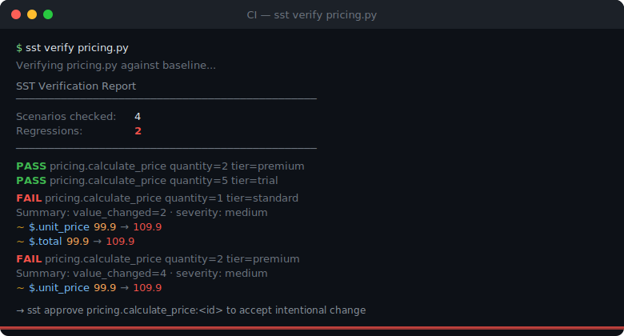

# SST — Semantic Shadow Testing

[](https://pypi.org/project/sst-python/)
[](https://github.com/gosa71/sst/actions/workflows/ci.yml)
[](https://github.com/gosa71/sst)
[](https://opensource.org/licenses/MIT)
[](https://www.python.org/)

**SST turns your production function calls into a regression firewall.**
One decorator. Automatic baselines. CI blocks the PR if behavior changed.

---

## The problem SST solves

You refactor a pricing function. Tests pass — they test what you wrote,
not what production actually does. Three days later a customer reports
wrong totals. The bug was in the edge case nobody thought to test.

SST captures real function calls, stores their inputs and outputs as
baselines, and fails CI the moment behavior diverges — for any input
it has ever seen.

---

## 60-second example

### 1. Decorate your function

```python
# pricing.py
from sst.core import sst

@sst.capture
def calculate_price(product_id: str, quantity: int, user_tier: str = "standard") -> dict:
    prices = {"SKU-001": 99.9, "SKU-002": 249.0, "SKU-003": 19.9}
    base = prices.get(product_id, 0.0)
    discount = {"premium": 0.15, "standard": 0.0, "trial": 0.05}.get(user_tier, 0.0)
    subtotal = round(base * quantity, 2)
    discount_amount = round(subtotal * discount, 2)
    total = round(subtotal - discount_amount, 2)
    return {
        "product_id": product_id,
        "quantity": quantity,
        "unit_price": base,
        "subtotal": subtotal,
        "discount": discount_amount,
        "total": total,
        "currency": "USD",
    }

if __name__ == "__main__":
    calculate_price("SKU-001", 1, "standard")
    calculate_price("SKU-001", 2, "premium")
    calculate_price("SKU-002", 1, "standard")
    calculate_price("SKU-003", 5, "trial")
```

### 2. Record the baseline

```bash
pip install sst-python
sst record pricing.py
# Baseline recorded: 4 scenarios saved to .sst_baseline/
```

### 3. Someone changes the price

```python
# prices = {"SKU-001": 99.9, ...}  ← before
prices = {"SKU-001": 109.9, ...}   # ← "small fix"
```

### 4. CI catches it

```bash
sst verify pricing.py
```



Exit code `1` — **the PR is blocked.**

### 5. Intentional change? Approve it.

```bash
sst approve pricing.calculate_price:<semantic_id>
```

Approval is recorded in the baseline with timestamp and history.
Commit `.sst_baseline/` to git — baselines are versioned alongside code.

---

## FastAPI integration

SST works with any Python function, including FastAPI endpoint handlers.
Decorate the business logic layer, not the route itself:

```python
# app/pricing.py
from fastapi import FastAPI
from sst.core import sst

app = FastAPI()

@sst.capture(sampling_rate=0.05)   # capture 5% of production traffic
def _calculate_price(product_id: str, quantity: int, tier: str) -> dict:
    # ... pricing logic ...
    return {"total": ..., "currency": "USD"}

@app.get("/price")
async def price_endpoint(product_id: str, quantity: int = 1, tier: str = "standard"):
    return _calculate_price(product_id, quantity, tier)
```

In production SST writes captures to `.shadow_data/` asynchronously within
the request lifecycle. On a staging run before release:

```bash
# Point at staging traffic captures, compare against baseline
sst verify app/pricing.py
```

---

## GitHub Actions — drop-in CI gate

Add this workflow to your repository. SST blocks the merge if any
captured scenario regresses:

```yaml
# .github/workflows/sst.yml
name: SST Regression Gate

on: [pull_request]

jobs:
  sst:
    runs-on: ubuntu-latest
    steps:
      - uses: actions/checkout@v4
      - run: pip install sst-python
      - run: sst verify pricing.py
```

That's it. Exit code `1` on regression means GitHub marks the check as
failed and blocks the merge until the change is approved with `sst approve`.

The `.sst_baseline/` directory must be committed to the repository so CI
has access to the recorded baselines.

---

## Installation

```bash
pip install sst-python

# With AI test generation (Claude / GPT-4):
pip install "sst-python[llm]"
```

Requires Python 3.10+.

---

## Core workflow

```
Record once          →   Verify on every PR   →   Approve intentional changes
sst record app.py        sst verify app.py        sst approve module.fn:<id>
      ↓                        ↓                          ↓
.sst_baseline/          exit 0 or 1              baseline updated
(commit to git)         (CI gate)                (auditable history)
```

---

## What gets captured

SST captures per-call snapshots keyed by a deterministic **semantic ID** —
a hash of the serialized, PII-masked inputs. Two calls with the same
inputs always produce the same semantic ID regardless of Python hash
randomization, dict ordering, or set iteration order.

Each snapshot stores:

- masked and serialized inputs
- function output or exception type
- SST engine version and diff policy snapshot (for policy drift detection)

Captures live in `.shadow_data/` (excluded from git). Baselines live in
`.sst_baseline/` (committed to git).

---

## PII masking

SST masks sensitive data **before** writing anything to disk.
Built-in patterns cover email, credit card, phone, SSN, IPv4.
Key-based masking covers `password`, `token`, `api_key`, `secret`,
`credential`, `auth`.

```python
@sst.capture
def process_payment(user: dict, amount: float) -> dict:
    # user["email"] and user["card_number"] are masked before capture
    ...
```

Custom patterns and keys:

```toml
# pyproject.toml
[tool.sst]
pii_keys = ["session_id", "internal_user_id"]
pii_patterns = [
    {label = "inn", pattern = "\\b\\d{10}\\b"},
]
```

---

## Diff policy

SST compares outputs after applying a normalization policy so volatile
fields don't create noise:

```toml
[tool.sst.diff_policy]
ignored_fields = ["timestamp", "request_id", "trace_id"]
float_tolerance = 0.000001
mask_timestamps = true
list_sort_paths = ["$.items", "$.tags"]
```

With this policy, `timestamp` changes are ignored, floats within `1e-6`
are equal, and lists at `$.items` are sorted before comparison — so
order-nondeterministic APIs produce stable baselines.

---

## Governance

Every baseline scenario has a lifecycle: `pending → approved → deprecated`.

```bash
sst baseline list                          # show all scenarios and status
sst baseline show pricing.calculate_price  # inspect a specific scenario
sst baseline deprecate pricing.fn:<id>     # retire an obsolete scenario
sst approve pricing.fn:<id>               # promote pending → approved
```

Approval history is stored in the baseline file and committed to git,
giving you an auditable record of every intentional behavior change.

---

## AI test generation

Turn captured scenarios into a full pytest suite:

```bash
sst generate --all --provider anthropic
# or
sst generate --all --provider openai
```

Generated tests include deterministic inputs reconstructed from captures,
mocks for external dependencies, and explicit assertions on output fields.
Syntax is validated before writing — no broken test files.

```python
# Auto-generated from capture
def test_calculate_price_standard_sku001():
    result = calculate_price("SKU-001", 1, "standard")
    assert result["total"] == 99.9
    assert result["currency"] == "USD"
    assert result["discount"] == 0.0
```

---

## CLI reference

```bash
sst record <file>              # capture behavior into .shadow_data/
sst record <file> --clean      # clear shadow_data before recording
sst verify <file>              # compare against baseline (exit 0/1)
sst verify <file> --json       # machine-readable JSON report
sst approve <scenario_id>      # approve intentional change
sst baseline list              # list all scenarios with status
sst baseline show <scenario>   # inspect a scenario record
sst baseline deprecate <id>    # mark scenario as deprecated
sst generate --all             # generate pytest stubs (no LLM)
sst generate --all --provider anthropic  # generate with Claude
```

**Exit codes:**

| Code | Meaning |
|------|---------|
| `0` | All scenarios pass |
| `1` | One or more regressions detected |
| `2` | Configuration or execution error |

---

## Configuration

All settings live in `pyproject.toml`. Environment variables override
file values at runtime — useful for CI without changing project files.

```toml
[tool.sst]
baseline_dir = ".sst_baseline"
shadow_dir   = ".shadow_data"
sampling_rate = 1.0            # set to 0.01–0.05 for production traffic
verify_timeout = 300           # seconds; increase for slow apps

[tool.sst.diff_policy]
ignored_fields = ["timestamp", "request_id"]
float_tolerance = 0.000001
mask_timestamps = true
```

Key environment overrides:

| Variable | Purpose |
|----------|---------|
| `SST_ENABLED` | Enable capture (`true`/`false`) |
| `SST_BASELINE_DIR` | Override baseline directory |
| `SST_SHADOW_DIR` | Override shadow directory |
| `SST_SAMPLING_RATE` | Override sampling rate |
| `SST_VERIFY_TIMEOUT` | Override verify timeout (seconds) |
| `SST_CAPTURE_ENABLED` | Master capture switch |

---

## Serializing custom objects

SST serializes standard Python types automatically. For custom classes,
implement `__sst_serialize__`:

```python
class Money:
    def __init__(self, amount: int, currency: str):
        self.amount = amount
        self.currency = currency

    def __sst_serialize__(self) -> dict:
        return {"amount": self.amount, "currency": self.currency}
```

Without `__sst_serialize__`, SST falls back to `__dict__` (deterministic
for most classes) or `repr()` (potentially non-deterministic for objects
with memory addresses in their repr — use `__sst_serialize__` when stable
`semantic_id` is required).

---

## Design decisions

### Failure scenarios in `SST_VERIFY=true` mode

When `SST_VERIFY=true` is set, SST compares the current function output
against the recorded baseline **for successful calls only**. If the
function raises an exception in verify mode, the exception propagates
as-is — the traceback is already the signal. The full failure-scenario
regression gate runs in `sst verify` (the replay pipeline), which
compares `error_type` across baseline and current captures.

**Summary:** in-process verify → success scenarios only.
`sst verify` → all scenarios including failures.

### Exception message is not compared in replay

When both baseline and current capture have `status: failure` with the
same `error_type`, SST reports no regression — even if the exception
message text differs.

Exception messages are unstable by nature: they often contain the
specific value that caused the failure (`"invalid price: -5.00"`),
object IDs, or locale-dependent phrasing. Comparing them directly would
produce false positives on every run. The exception **type** is the
stable, semantic part of a failure contract and is always compared.

If the exception message is part of your public contract, surface it as
a structured field in the function's return value:

```python
@sst.capture
def safe_divide(x, y):
    try:
        return {"ok": True, "result": x / y}
    except ZeroDivisionError as exc:
        return {"ok": False, "error": str(exc)}
```

---

## Versioning and compatibility

SST baselines store the engine version and policy snapshot used at
capture time. During `sst verify`:

- If the baseline engine version differs from the current SST version,
  an advisory warning is emitted.
- If the diff policy snapshot differs from the current runtime policy,
  SST reports `POLICY_DRIFT` and fails the scenario.

Older baselines without these fields still load; missing fields produce
advisory warnings, not hard failures. Re-approval is recommended when
policy or engine version changes materially.

---

## License

MIT — see [LICENSE](LICENSE).

## Contributing

[github.com/gosa71/sst](https://github.com/gosa71/sst)
